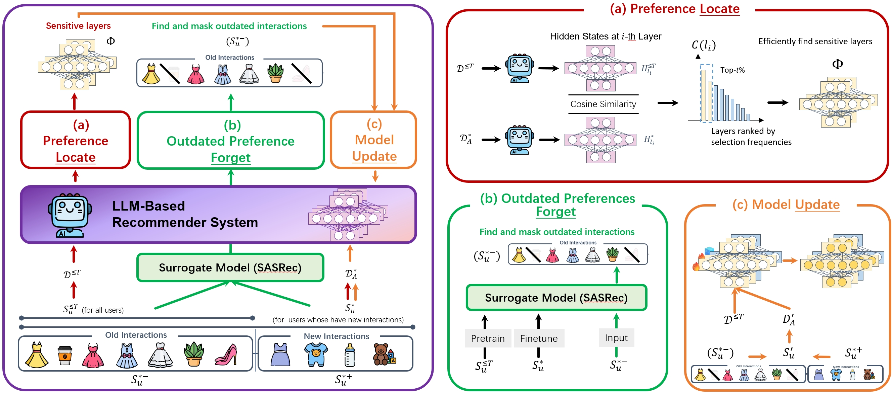

# EvoRec: An Efficient LLM-based Evolutional Recommendation with Locate-Forget-Update Paradigm

<div align="center">



</div>

## 📖 Overview

**EvoRec** is an efficient incremental recommendation framework that leverages large language models (LLMs) with a novel **Locate-Forget-Update** paradigm. This repository provides a complete pipeline for training, fine-tuning, and evaluating the EvoRec system, enabling dynamic adaptation to evolving user preferences while maintaining computational efficiency.

## 📊 Dataset

Download the dataset from Baidu Netdisk:
- **Link**: https://pan.baidu.com/s/1OlnlAErfXWZZMJ3gVSHKag
- **Extract Code**: `h6du`

## 🚀 Quick Start

Follow the complete workflow below to train and evaluate EvoRec:

### Step 1: Train the Baseline LLMRec Model

Train the original LLM-based recommendation model:

```bash
cd EvoRec
sh train_sft.sh
```

### Step 2: Baseline Inference

Perform inference using the original LLM on data with updated user interactions:

```bash
cd inference_all
sh vllm_lora_sft.sh
```

### Step 3: Locate Sensitive Parameters

Identify model parameters most sensitive to outdated or biased knowledge:

```bash
sh localization.sh
```

### Step 4: Forget Outdated Information

Execute the unlearning process to remove outdated data while preserving useful knowledge:

```bash
sh unlearning.sh
```

### Step 5: Validate and Select Best Checkpoint

Find the optimal checkpoint based on validation set performance:

```bash
cd inference_update
sh vllm_lora_edit.sh
```

### Step 6: Generate Final Recommendations

Run inference on the complete dataset to obtain final recommendation results:

```bash
cd ../inference_all
sh vllm_lora_edit.sh
```

